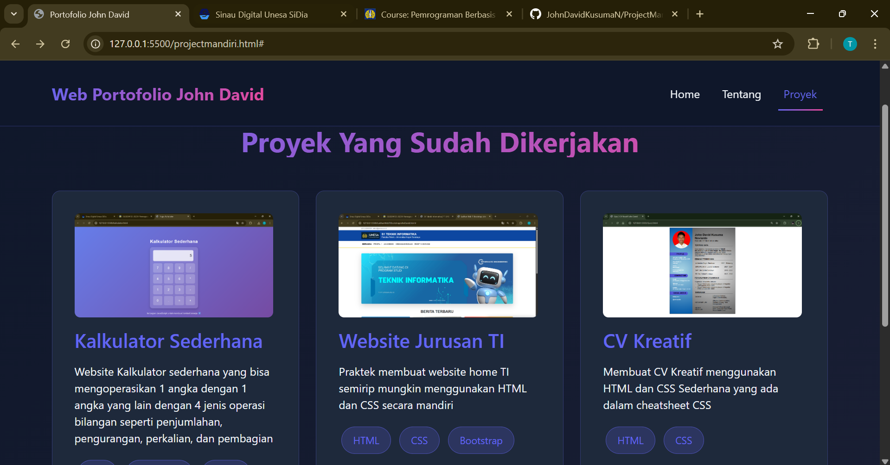

# Website Portofolio Pribadi

Website portofolio pribadi yang dibuat sebagai tugas front-end web development dengan menggunakan HTML, CSS, JavaScript, dan Bootstrap Framework.

## Deskripsi Proyek

Website ini menampilkan profil pribadi seorang developer dengan fitur-fitur interaktif. Terdiri dari 3 halaman utama yang saling terhubung:
- **Home**: Halaman beranda dengan hero section dan keahlian utama
- **Tentang**: Profil singkat, pengalaman kerja, dan skill/teknologi
- **Proyek**: Showcase proyek-proyek terbaru dengan deskripsi

## Fitur Utama

- Responsive Design (Mobile, Tablet, Desktop)
- Dark Theme Modern dengan Gradient Colors
- Navigasi Interaktif dengan Page Switching
- Smooth Animations & Hover Effects
- Bootstrap Framework Integration
- Clean & Organized Code Structure

## Teknologi yang Digunakan

### Frontend
- **HTML5** - Struktur semantic halaman
- **CSS3** - Styling custom dengan CSS Variables
- **JavaScript** - Interaktivitas page switching & mobile menu
- **Bootstrap 5.3** - CSS Framework untuk responsive design
- **Font Awesome 6.4** - Icon library

### Tools
- **VS Code** - Text Editor
- **Git** - Version Control
- **GitHub** - Repository Hosting

## Cara Menggunakan

### 1. Clone Repository
```bash
git clone https://github.com/username/portfolio-website.git
cd portfolio-website
```

### 2. Buka di Browser
- Cukup double-click file `projectmandiri.html`
- atau klik kanan → Open with → Browser

### 3. Navigasi Website
- Klik menu di navbar untuk berpindah halaman
- Responsive pada semua ukuran layar
- Support dark theme

## Fitur Interaktif

### JavaScript Implementation
- **Page Navigation**: Switching halaman tanpa reload
- **Mobile Menu**: Navbar collapse otomatis di mobile
- **Smooth Scrolling**: Scroll ke top saat pindah halaman
- **Active Navigation**: Indicator halaman yang aktif

### CSS Animations
- **Hero Section**: Floating background animation
- **Fade In**: Smooth transition saat load halaman
- **Card Hover**: Lift effect saat hover di card
- **Button Hover**: Transform effect dengan shadow

## CSS Framework (Bootstrap) Usage

### Grid System
```html
<div class="container">
  <div class="row g-4">
    <div class="col-md-3 col-sm-6">...</div>
  </div>
</div>
```

### Responsive Classes
- `col-md-*` untuk tablet (768px+)
- `col-lg-*` untuk desktop (1200px+)
- `col-sm-*` untuk mobile landscape (576px+)

### Utilities
- Spacing: `m-*`, `p-*`, `g-*`
- Text: `text-center`
- Display: `d-flex`

## Screenshot

### Home Page


### About Page


### Projects Page



## Video Demo

Tonton demo lengkap website di: [Link Video YouTube](https://youtube.com/...)

Akan menampilkan:
- Navigasi antar halaman
- Responsive design (desktop → mobile)
- Smooth animations & hover effects
- Code walkthrough singkat

## Penulis

John David Kusuma Novianto
- Email: 24051204026@mhs.unesa.ac.id
- LinkedIn: [Profile LinkedIn](https://www.linkedin.com/in/john-david-kusuma-novianto-b0492b31b/)
- GitHub: [@JohnDavidKusumaN](https://github.com/JohnDavidKusumaN)

## Lisensi

Project ini bersifat open source dan dapat digunakan untuk keperluan pendidikan.

---

**Last Updated**: 23 Oktober 2025
